

## Visualización de variables en tile d001


```python
%matplotlib inline
import numpy as np
import matplotlib.pylab as plt
import scipy.stats as stat
import os
import sys
import subprocess

path = '/home/nico/Dropbox/scripts/'
sys.path.append(os.path.abspath(path))

tile = 'd001'
camino_principal = '/home/nico/Documentos/Doctorado/V⁴/'

#Funciones propias
from functions import ReadCords, ReadFile, Readlc, phase_LC_plot, grid, \
                      Do_IP_metric, var_non_regular, plot_lc_phase
```

# Estrellas periodicas:


```python
#Leemos el catálogo principal
V4 = ReadFile('V⁴_Catalog.cat',path=camino_principal, ReadStr=True)

#Filtramos para d001
V4 = V4[V4[:,28]==tile]

periodics = np.array([V4[i] for i in range(len(V4[:,1])) if V4[i,29] != '""'])
non_perio = np.array([V4[i] for i in range(len(V4[:,1])) if V4[i,29] == '""'])

#periodicas:
ID      = [ (periodics[i,0]+str('.cat')) for i in range(len(periodics[:,0]))]
Cats    = periodics[:,3]
Classes = periodics[:,27]
Periods = [float(periodics[i,29]) for i in range(len(periodics[:,29]))]

#No periodicas:
ID_non      = [ (non_perio[i,0]+str('.cat')) for i in range(len(non_perio[:,0]))]
Cats_non    = non_perio[:,3]
Classes_non = non_perio[:,27]
```


```python
#Camino a las curvas:
path=camino_principal+tile

for i in range(len(Cats)):
    mjd,mag,err = Readlc(ID[i],path=path)
    Class = Classes[i]
    p = Periods[i]
    Nterms = 2
    
    #Casos especiales para LPVs:
    if ID[i] == 'd001-54.cat' or ID[i] == 'd001-79.cat':
        Nterms = 1    
    
    print '---------------------------------------------------------------------------------'
    #print cat_path
    print "Nombre del catálogo: ",ID[i]
    print "Catalogo: ",Cats[i]
    print "amplitud: %0.3f [mag] " %(max(mag)-min(mag))
    print "N° épocas: ",len(mag)
    print "Magnitud media: %0.3f [mag]" %np.mean(mag)
    print "Periodo: %0.4f [dias]" %p
    print "Clase: ", Class       
        
    plot_lc_phase(ID[i], path, p, Nterms=Nterms, tile=tile, tipo=Class, name=ID[i])   
        
    plt.show()
```

    ---------------------------------------------------------------------------------
    Nombre del catálogo:  d001-5.cat
    Catalogo:  174.37960641-63.40070793.lc
    amplitud: 1.439 [mag] 
    N° épocas:  41
    Magnitud media: 15.247 [mag]
    Periodo: 90.2765 [dias]
    Clase:  LPV-YSO


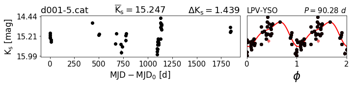


    ---------------------------------------------------------------------------------
    Nombre del catálogo:  d001-10.cat
    Catalogo:  174.49856436-63.21059924.lc
    amplitud: 0.476 [mag] 
    N° épocas:  43
    Magnitud media: 13.841 [mag]
    Periodo: 129.9350 [dias]
    Clase:  Unclass


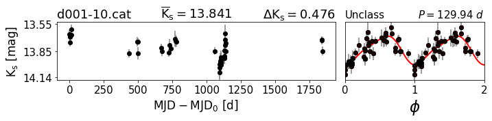


    ---------------------------------------------------------------------------------
    Nombre del catálogo:  d001-14.cat
    Catalogo:  174.52235901-63.34128111.lc
    amplitud: 0.504 [mag] 
    N° épocas:  43
    Magnitud media: 15.188 [mag]
    Periodo: 107.3390 [dias]
    Clase:  LPV-YSO


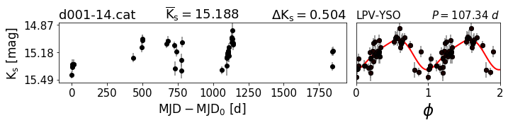


    ---------------------------------------------------------------------------------
    Nombre del catálogo:  d001-16.cat
    Catalogo:  174.55346357-63.20233576.lc
    amplitud: 0.404 [mag] 
    N° épocas:  39
    Magnitud media: 14.484 [mag]
    Periodo: 1.3700 [dias]
    Clase:  ClCeph


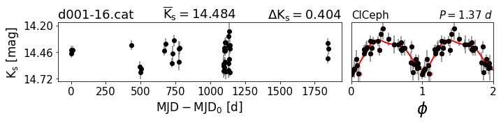


    ---------------------------------------------------------------------------------
    Nombre del catálogo:  d001-30.cat
    Catalogo:  174.78494971-63.72963024.lc
    amplitud: 0.833 [mag] 
    N° épocas:  43
    Magnitud media: 13.889 [mag]
    Periodo: 55.2480 [dias]
    Clase:  LPV-YSO


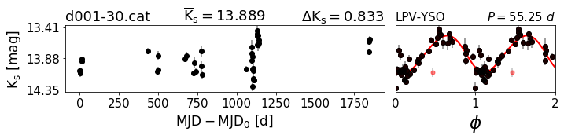


    ---------------------------------------------------------------------------------
    Nombre del catálogo:  d001-37.cat
    Catalogo:  174.8623778-63.46894123.lc
    amplitud: 0.453 [mag] 
    N° épocas:  43
    Magnitud media: 14.421 [mag]
    Periodo: 42.7060 [dias]
    Clase:  Unclass


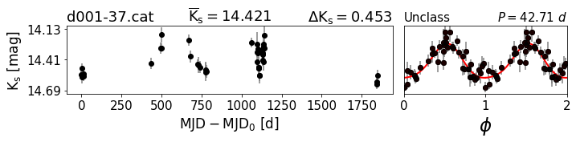


    ---------------------------------------------------------------------------------
    Nombre del catálogo:  d001-38.cat
    Catalogo:  174.87844157-62.86599294.lc
    amplitud: 0.650 [mag] 
    N° épocas:  41
    Magnitud media: 14.167 [mag]
    Periodo: 0.3953 [dias]
    Clase:  RRc


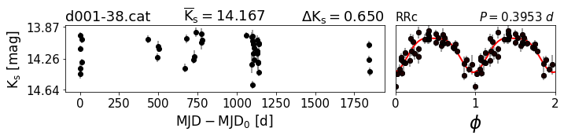


    ---------------------------------------------------------------------------------
    Nombre del catálogo:  d001-39.cat
    Catalogo:  174.88710825-62.98821187.lc
    amplitud: 0.667 [mag] 
    N° épocas:  40
    Magnitud media: 13.363 [mag]
    Periodo: 107.5050 [dias]
    Clase:  LPV-YSO


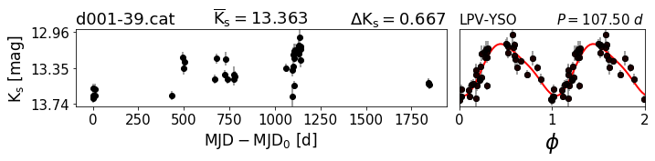


    ---------------------------------------------------------------------------------
    Nombre del catálogo:  d001-40.cat
    Catalogo:  174.90503438-63.74297262.lc
    amplitud: 0.395 [mag] 
    N° épocas:  44
    Magnitud media: 15.010 [mag]
    Periodo: 0.3488 [dias]
    Clase:  RRc


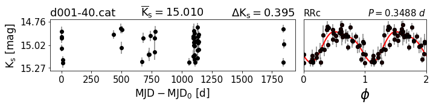


    ---------------------------------------------------------------------------------
    Nombre del catálogo:  d001-47.cat
    Catalogo:  175.31075221-63.03529086.lc
    amplitud: 0.469 [mag] 
    N° épocas:  41
    Magnitud media: 14.793 [mag]
    Periodo: 0.6409 [dias]
    Clase:  RRab


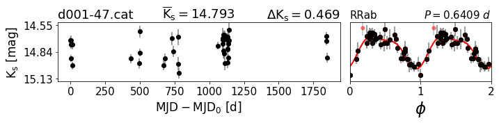


    ---------------------------------------------------------------------------------
    Nombre del catálogo:  d001-48.cat
    Catalogo:  175.32699139-63.8683344.lc
    amplitud: 0.500 [mag] 
    N° épocas:  41
    Magnitud media: 14.541 [mag]
    Periodo: 0.3878 [dias]
    Clase:  RRc


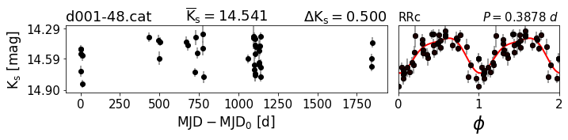


    ---------------------------------------------------------------------------------
    Nombre del catálogo:  d001-50.cat
    Catalogo:  175.4259293-63.7143567.lc
    amplitud: 0.462 [mag] 
    N° épocas:  43
    Magnitud media: 13.428 [mag]
    Periodo: 0.5260 [dias]
    Clase:  RRab


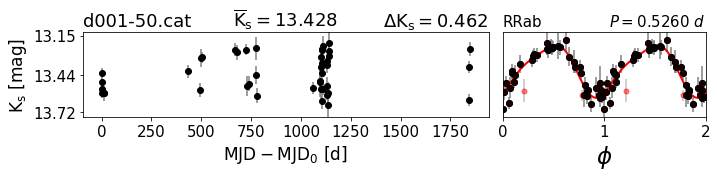


    ---------------------------------------------------------------------------------
    Nombre del catálogo:  d001-51.cat
    Catalogo:  175.46935098-63.48317698.lc
    amplitud: 0.316 [mag] 
    N° épocas:  42
    Magnitud media: 11.986 [mag]
    Periodo: 22.2120 [dias]
    Clase:  Unclass


    ---------------------------------------------------------------------------------
    Nombre del catálogo:  d001-54.cat
    Catalogo:  175.7118125-63.3506535.lc
    amplitud: 1.489 [mag] 
    N° épocas:  43
    Magnitud media: 14.137 [mag]
    Periodo: 467.6290 [dias]
    Clase:  LPV-YSO


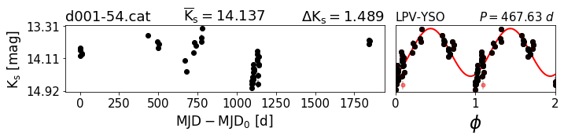


    ---------------------------------------------------------------------------------
    Nombre del catálogo:  d001-55.cat
    Catalogo:  175.73341657-63.06706191.lc
    amplitud: 0.549 [mag] 
    N° épocas:  41
    Magnitud media: 14.532 [mag]
    Periodo: 0.2938 [dias]
    Clase:  RRc


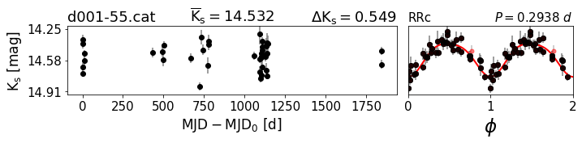


    ---------------------------------------------------------------------------------
    Nombre del catálogo:  d001-57.cat
    Catalogo:  175.80425-63.7939947.lc
    amplitud: 0.462 [mag] 
    N° épocas:  40
    Magnitud media: 14.985 [mag]
    Periodo: 0.2212 [dias]
    Clase:  RRc


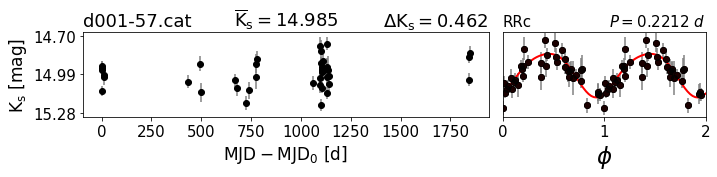


    ---------------------------------------------------------------------------------
    Nombre del catálogo:  d001-58.cat
    Catalogo:  175.81602886-63.76981629.lc
    amplitud: 0.621 [mag] 
    N° épocas:  42
    Magnitud media: 13.497 [mag]
    Periodo: 2.0345 [dias]
    Clase:  Binary


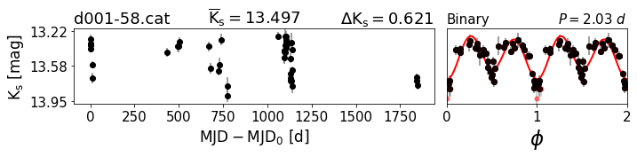


    ---------------------------------------------------------------------------------
    Nombre del catálogo:  d001-59.cat
    Catalogo:  175.81941996-63.43320197.lc
    amplitud: 0.535 [mag] 
    N° épocas:  42
    Magnitud media: 13.823 [mag]
    Periodo: 1.3802 [dias]
    Clase:  Binary


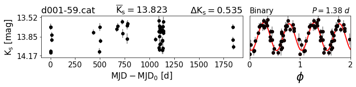


    ---------------------------------------------------------------------------------
    Nombre del catálogo:  d001-60.cat
    Catalogo:  175.86554012-63.17575634.lc
    amplitud: 0.442 [mag] 
    N° épocas:  43
    Magnitud media: 14.423 [mag]
    Periodo: 2.7253 [dias]
    Clase:  ClCeph


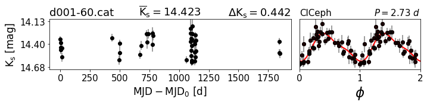


    ---------------------------------------------------------------------------------
    Nombre del catálogo:  d001-61.cat
    Catalogo:  175.89435537-63.48688388.lc
    amplitud: 0.381 [mag] 
    N° épocas:  44
    Magnitud media: 15.103 [mag]
    Periodo: 0.3959 [dias]
    Clase:  Binary


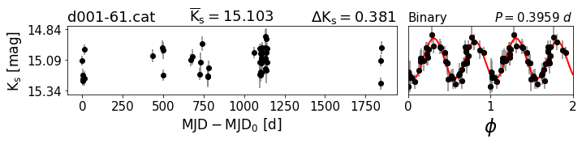


    ---------------------------------------------------------------------------------
    Nombre del catálogo:  d001-62.cat
    Catalogo:  175.90239642-63.58785859.lc
    amplitud: 0.371 [mag] 
    N° épocas:  41
    Magnitud media: 15.486 [mag]
    Periodo: 1.7289 [dias]
    Clase:  Binary


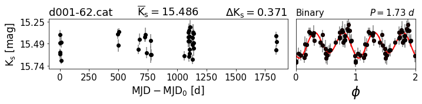


    ---------------------------------------------------------------------------------
    Nombre del catálogo:  d001-63.cat
    Catalogo:  175.9119863-63.04846024.lc
    amplitud: 0.643 [mag] 
    N° épocas:  43
    Magnitud media: 15.221 [mag]
    Periodo: 0.3800 [dias]
    Clase:  Binary


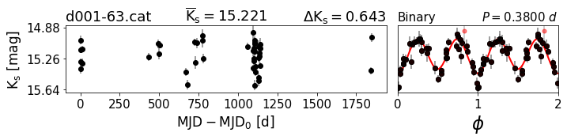


    ---------------------------------------------------------------------------------
    Nombre del catálogo:  d001-64.cat
    Catalogo:  175.98482029-63.54705263.lc
    amplitud: 0.418 [mag] 
    N° épocas:  42
    Magnitud media: 15.481 [mag]
    Periodo: 1.1348 [dias]
    Clase:  Binary


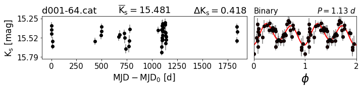


    ---------------------------------------------------------------------------------
    Nombre del catálogo:  d001-65.cat
    Catalogo:  175.98550313-62.99962697.lc
    amplitud: 0.656 [mag] 
    N° épocas:  44
    Magnitud media: 14.966 [mag]
    Periodo: 0.6312 [dias]
    Clase:  RRab


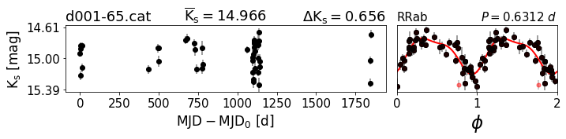


    ---------------------------------------------------------------------------------
    Nombre del catálogo:  d001-66.cat
    Catalogo:  176.0366045-63.21660528.lc
    amplitud: 0.344 [mag] 
    N° épocas:  41
    Magnitud media: 15.324 [mag]
    Periodo: 0.2585 [dias]
    Clase:  RRc


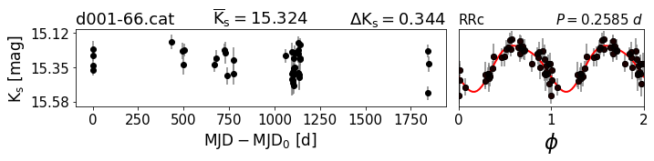


    ---------------------------------------------------------------------------------
    Nombre del catálogo:  d001-67.cat
    Catalogo:  176.03901285-63.92788185.lc
    amplitud: 0.490 [mag] 
    N° épocas:  41
    Magnitud media: 15.336 [mag]
    Periodo: 0.2861 [dias]
    Clase:  RRc


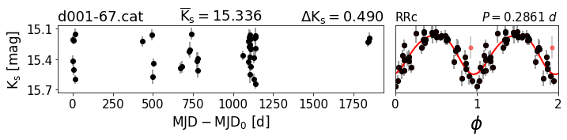


    ---------------------------------------------------------------------------------
    Nombre del catálogo:  d001-68.cat
    Catalogo:  176.06975843-63.16096517.lc
    amplitud: 0.416 [mag] 
    N° épocas:  43
    Magnitud media: 15.244 [mag]
    Periodo: 2.3272 [dias]
    Clase:  ClCeph


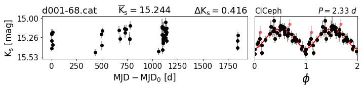


    ---------------------------------------------------------------------------------
    Nombre del catálogo:  d001-69.cat
    Catalogo:  176.07032071-63.90527342.lc
    amplitud: 0.482 [mag] 
    N° épocas:  40
    Magnitud media: 15.195 [mag]
    Periodo: 0.3664 [dias]
    Clase:  Binary


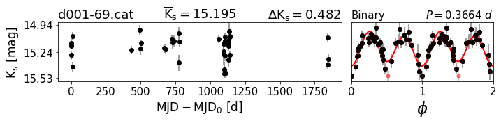


    ---------------------------------------------------------------------------------
    Nombre del catálogo:  d001-70.cat
    Catalogo:  176.1806865-63.01201439.lc
    amplitud: 0.454 [mag] 
    N° épocas:  42
    Magnitud media: 11.712 [mag]
    Periodo: 9.0980 [dias]
    Clase:  ClCeph


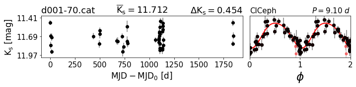


    ---------------------------------------------------------------------------------
    Nombre del catálogo:  d001-71.cat
    Catalogo:  176.22381702-63.54206851.lc
    amplitud: 0.455 [mag] 
    N° épocas:  43
    Magnitud media: 14.827 [mag]
    Periodo: 0.2919 [dias]
    Clase:  RRc


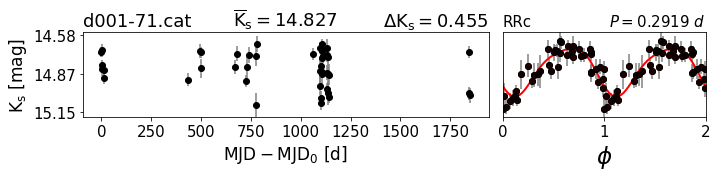


    ---------------------------------------------------------------------------------
    Nombre del catálogo:  d001-72.cat
    Catalogo:  176.23225073-63.28087652.lc
    amplitud: 0.512 [mag] 
    N° épocas:  42
    Magnitud media: 14.845 [mag]
    Periodo: 0.8780 [dias]
    Clase:  Binary


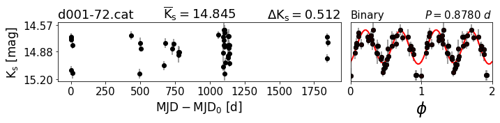


    ---------------------------------------------------------------------------------
    Nombre del catálogo:  d001-73.cat
    Catalogo:  176.34899401-64.11225287.lc
    amplitud: 0.417 [mag] 
    N° épocas:  42
    Magnitud media: 15.194 [mag]
    Periodo: 0.2560 [dias]
    Clase:  RRc


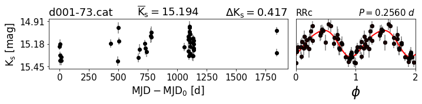


    ---------------------------------------------------------------------------------
    Nombre del catálogo:  d001-76.cat
    Catalogo:  176.51367354-63.71960792.lc
    amplitud: 0.480 [mag] 
    N° épocas:  44
    Magnitud media: 14.993 [mag]
    Periodo: 0.7986 [dias]
    Clase:  Binary


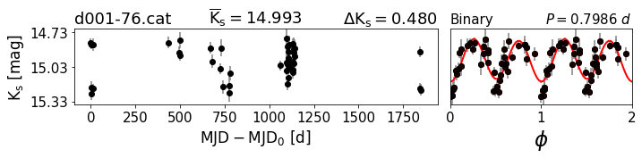


    ---------------------------------------------------------------------------------
    Nombre del catálogo:  d001-77.cat
    Catalogo:  176.53615904-63.46404685.lc
    amplitud: 0.669 [mag] 
    N° épocas:  40
    Magnitud media: 13.717 [mag]
    Periodo: 0.5829 [dias]
    Clase:  RRab


    ---------------------------------------------------------------------------------
    Nombre del catálogo:  d001-78.cat
    Catalogo:  176.55247701-63.31011735.lc
    amplitud: 0.434 [mag] 
    N° épocas:  41
    Magnitud media: 15.196 [mag]
    Periodo: 0.3034 [dias]
    Clase:  RRc


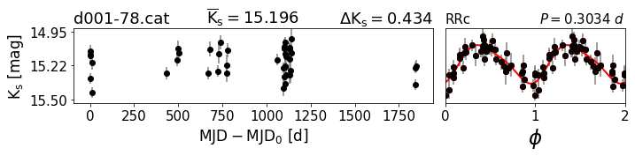


    ---------------------------------------------------------------------------------
    Nombre del catálogo:  d001-79.cat
    Catalogo:  176.5582990-63.78730990.lc
    amplitud: 3.296 [mag] 
    N° épocas:  27
    Magnitud media: 12.488 [mag]
    Periodo: 1423.2000 [dias]
    Clase:  LPV


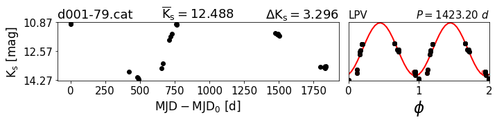


    ---------------------------------------------------------------------------------
    Nombre del catálogo:  d001-80.cat
    Catalogo:  176.65425768-63.3286217.lc
    amplitud: 0.513 [mag] 
    N° épocas:  43
    Magnitud media: 15.550 [mag]
    Periodo: 0.7683 [dias]
    Clase:  RRab


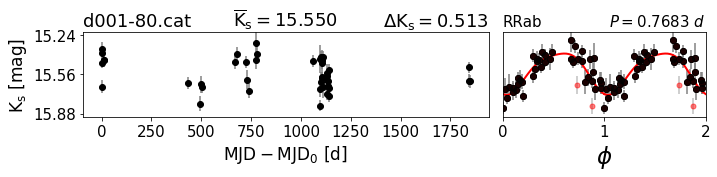


    ---------------------------------------------------------------------------------
    Nombre del catálogo:  d001-81.cat
    Catalogo:  176.65906637-63.15002974.lc
    amplitud: 0.551 [mag] 
    N° épocas:  42
    Magnitud media: 12.841 [mag]
    Periodo: 0.3262 [dias]
    Clase:  RRc


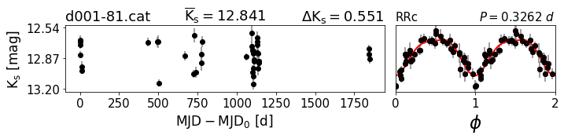


    ---------------------------------------------------------------------------------
    Nombre del catálogo:  d001-83.cat
    Catalogo:  176.76483532-63.66787666.lc
    amplitud: 0.610 [mag] 
    N° épocas:  44
    Magnitud media: 15.006 [mag]
    Periodo: 0.3318 [dias]
    Clase:  Binary


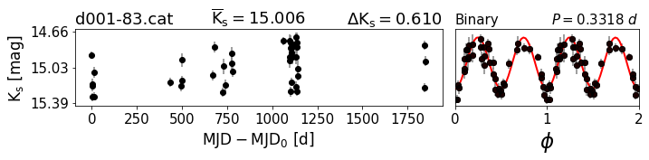


    ---------------------------------------------------------------------------------
    Nombre del catálogo:  d001-84.cat
    Catalogo:  176.80316437-63.31172241.lc
    amplitud: 0.372 [mag] 
    N° épocas:  42
    Magnitud media: 14.837 [mag]
    Periodo: 0.2953 [dias]
    Clase:  RRc


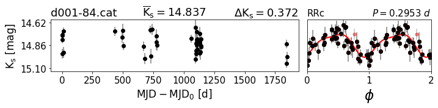


    ---------------------------------------------------------------------------------
    Nombre del catálogo:  d001-85.cat
    Catalogo:  176.90751587-63.59649822.lc
    amplitud: 0.448 [mag] 
    N° épocas:  44
    Magnitud media: 13.411 [mag]
    Periodo: 0.3913 [dias]
    Clase:  RRc


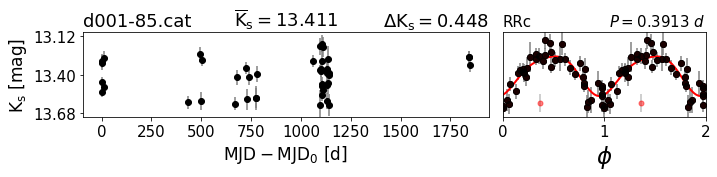


    ---------------------------------------------------------------------------------
    Nombre del catálogo:  d001-86.cat
    Catalogo:  176.95534561-63.91038628.lc
    amplitud: 0.536 [mag] 
    N° épocas:  42
    Magnitud media: 15.512 [mag]
    Periodo: 0.2156 [dias]
    Clase:  RRc


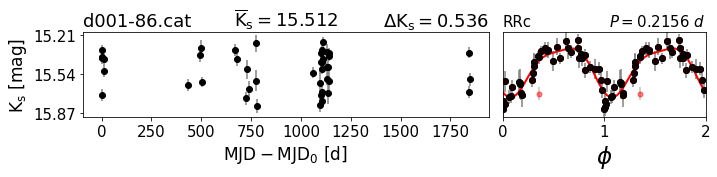


    ---------------------------------------------------------------------------------
    Nombre del catálogo:  d001-87.cat
    Catalogo:  177.0640518-63.67022001.lc
    amplitud: 0.528 [mag] 
    N° épocas:  44
    Magnitud media: 14.024 [mag]
    Periodo: 0.3518 [dias]
    Clase:  RRc


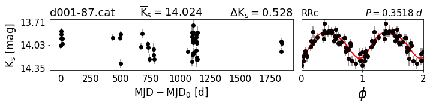


    ---------------------------------------------------------------------------------
    Nombre del catálogo:  d001-88.cat
    Catalogo:  177.14036094-63.27574684.lc
    amplitud: 0.816 [mag] 
    N° épocas:  44
    Magnitud media: 15.936 [mag]
    Periodo: 0.3127 [dias]
    Clase:  Binary


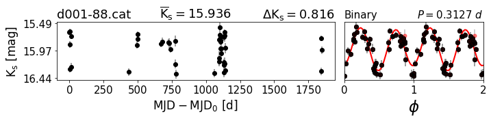


    ---------------------------------------------------------------------------------
    Nombre del catálogo:  d001-89.cat
    Catalogo:  177.18554945-63.911158.lc
    amplitud: 0.482 [mag] 
    N° épocas:  44
    Magnitud media: 14.905 [mag]
    Periodo: 0.5469 [dias]
    Clase:  RRab


    ---------------------------------------------------------------------------------
    Nombre del catálogo:  d001-90.cat
    Catalogo:  177.20238119-63.57344546.lc
    amplitud: 0.470 [mag] 
    N° épocas:  43
    Magnitud media: 13.614 [mag]
    Periodo: 0.2169 [dias]
    Clase:  RRc


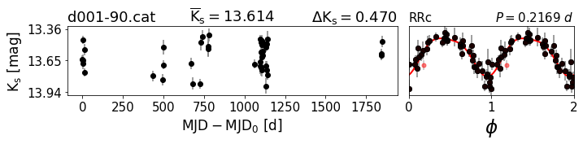


    ---------------------------------------------------------------------------------
    Nombre del catálogo:  d001-91.cat
    Catalogo:  177.21970433-63.38229484.lc
    amplitud: 0.565 [mag] 
    N° épocas:  44
    Magnitud media: 13.498 [mag]
    Periodo: 0.3608 [dias]
    Clase:  RRc


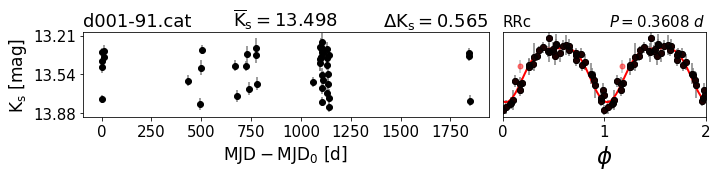


    ---------------------------------------------------------------------------------
    Nombre del catálogo:  d001-93.cat
    Catalogo:  177.65143891-63.23959631.lc
    amplitud: 0.574 [mag] 
    N° épocas:  41
    Magnitud media: 14.885 [mag]
    Periodo: 0.2962 [dias]
    Clase:  Binary


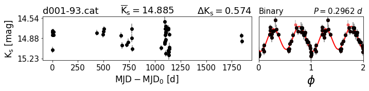


# Fuentes Irregulares:


```python
#Camino a las curvas:
path=camino_principal+tile

for i in range(len(ID_non)):
    
    mjd,mag,err = Readlc(ID_non[i], path=path)

    print '---------------------------------------------------------------------------------'
    #print cat_path
    print "Nombre del catálogo: ",ID_non[i]
    print "amplitud: %0.3f [mag] " %(max(mag)-min(mag))
    print "N° épocas: ",len(mag)
    print "Magnitud media: %0.3f [mag]" %np.mean(mag)
    print "Clase: ", Classes_non[i]    
    
    var_non_regular(mjd,mag,err,size=(8,2.5),name=Classes_non[i] ,ms=10,mjd0=None)        
    plt.show()
```

    ---------------------------------------------------------------------------------
    Nombre del catálogo:  d001-1.cat
    amplitud: 0.951 [mag] 
    N° épocas:  40
    Magnitud media: 14.212 [mag]
    Clase:  Unclass


    ---------------------------------------------------------------------------------
    Nombre del catálogo:  d001-2.cat
    amplitud: 0.852 [mag] 
    N° épocas:  42
    Magnitud media: 14.840 [mag]
    Clase:  LAE


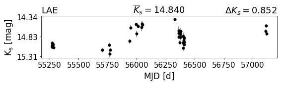


    ---------------------------------------------------------------------------------
    Nombre del catálogo:  d001-3.cat
    amplitud: 0.776 [mag] 
    N° épocas:  43
    Magnitud media: 14.486 [mag]
    Clase:  STV


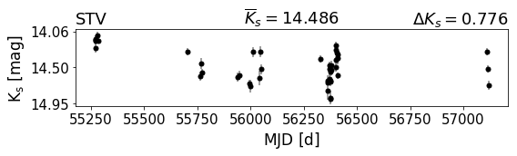


    ---------------------------------------------------------------------------------
    Nombre del catálogo:  d001-4.cat
    amplitud: 1.295 [mag] 
    N° épocas:  33
    Magnitud media: 13.105 [mag]
    Clase:  Unclass


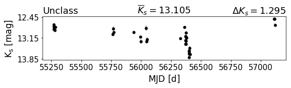


    ---------------------------------------------------------------------------------
    Nombre del catálogo:  d001-6.cat
    amplitud: 1.049 [mag] 
    N° épocas:  43
    Magnitud media: 15.796 [mag]
    Clase:  Eruptive


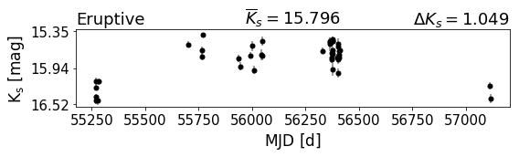


    ---------------------------------------------------------------------------------
    Nombre del catálogo:  d001-7.cat
    amplitud: 1.279 [mag] 
    N° épocas:  41
    Magnitud media: 16.224 [mag]
    Clase:  Unclass


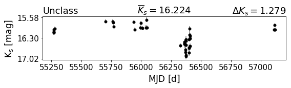


    ---------------------------------------------------------------------------------
    Nombre del catálogo:  d001-8.cat
    amplitud: 1.033 [mag] 
    N° épocas:  38
    Magnitud media: 14.517 [mag]
    Clase:  STV


    ---------------------------------------------------------------------------------
    Nombre del catálogo:  d001-9.cat
    amplitud: 1.052 [mag] 
    N° épocas:  43
    Magnitud media: 15.372 [mag]
    Clase:  STV


    ---------------------------------------------------------------------------------
    Nombre del catálogo:  d001-11.cat
    amplitud: 1.416 [mag] 
    N° épocas:  42
    Magnitud media: 16.332 [mag]
    Clase:  Eruptive


    ---------------------------------------------------------------------------------
    Nombre del catálogo:  d001-12.cat
    amplitud: 1.773 [mag] 
    N° épocas:  41
    Magnitud media: 16.037 [mag]
    Clase:  Eruptive


    ---------------------------------------------------------------------------------
    Nombre del catálogo:  d001-13.cat
    amplitud: 1.575 [mag] 
    N° épocas:  37
    Magnitud media: 14.930 [mag]
    Clase:  Eruptive


    ---------------------------------------------------------------------------------
    Nombre del catálogo:  d001-15.cat
    amplitud: 1.754 [mag] 
    N° épocas:  43
    Magnitud media: 14.690 [mag]
    Clase:  Dipper


    ---------------------------------------------------------------------------------
    Nombre del catálogo:  d001-17.cat
    amplitud: 1.021 [mag] 
    N° épocas:  43
    Magnitud media: 15.633 [mag]
    Clase:  STV


    ---------------------------------------------------------------------------------
    Nombre del catálogo:  d001-18.cat
    amplitud: 0.747 [mag] 
    N° épocas:  44
    Magnitud media: 13.445 [mag]
    Clase:  STV


    ---------------------------------------------------------------------------------
    Nombre del catálogo:  d001-19.cat
    amplitud: 0.938 [mag] 
    N° épocas:  43
    Magnitud media: 14.609 [mag]
    Clase:  Unclass


    ---------------------------------------------------------------------------------
    Nombre del catálogo:  d001-20.cat
    amplitud: 0.968 [mag] 
    N° épocas:  41
    Magnitud media: 11.899 [mag]
    Clase:  STV


    ---------------------------------------------------------------------------------
    Nombre del catálogo:  d001-21.cat
    amplitud: 0.773 [mag] 
    N° épocas:  43
    Magnitud media: 15.097 [mag]
    Clase:  Unclass


    ---------------------------------------------------------------------------------
    Nombre del catálogo:  d001-22.cat
    amplitud: 0.794 [mag] 
    N° épocas:  25
    Magnitud media: 13.425 [mag]
    Clase:  Fader


    ---------------------------------------------------------------------------------
    Nombre del catálogo:  d001-23.cat
    amplitud: 0.683 [mag] 
    N° épocas:  41
    Magnitud media: 14.160 [mag]
    Clase:  STV


    ---------------------------------------------------------------------------------
    Nombre del catálogo:  d001-24.cat
    amplitud: 0.551 [mag] 
    N° épocas:  42
    Magnitud media: 13.675 [mag]
    Clase:  STV


    ---------------------------------------------------------------------------------
    Nombre del catálogo:  d001-25.cat
    amplitud: 1.027 [mag] 
    N° épocas:  40
    Magnitud media: 15.770 [mag]
    Clase:  STV


    ---------------------------------------------------------------------------------
    Nombre del catálogo:  d001-26.cat
    amplitud: 0.752 [mag] 
    N° épocas:  42
    Magnitud media: 13.830 [mag]
    Clase:  LAE


    ---------------------------------------------------------------------------------
    Nombre del catálogo:  d001-27.cat
    amplitud: 0.636 [mag] 
    N° épocas:  43
    Magnitud media: 14.867 [mag]
    Clase:  LAE


    ---------------------------------------------------------------------------------
    Nombre del catálogo:  d001-28.cat
    amplitud: 0.641 [mag] 
    N° épocas:  41
    Magnitud media: 12.864 [mag]
    Clase:  Unclass


    ---------------------------------------------------------------------------------
    Nombre del catálogo:  d001-29.cat
    amplitud: 0.879 [mag] 
    N° épocas:  40
    Magnitud media: 13.508 [mag]
    Clase:  STV


    ---------------------------------------------------------------------------------
    Nombre del catálogo:  d001-31.cat
    amplitud: 0.966 [mag] 
    N° épocas:  42
    Magnitud media: 12.934 [mag]
    Clase:  STV


    ---------------------------------------------------------------------------------
    Nombre del catálogo:  d001-32.cat
    amplitud: 0.811 [mag] 
    N° épocas:  43
    Magnitud media: 14.127 [mag]
    Clase:  STV


    ---------------------------------------------------------------------------------
    Nombre del catálogo:  d001-33.cat
    amplitud: 0.824 [mag] 
    N° épocas:  44
    Magnitud media: 13.876 [mag]
    Clase:  LAE


    ---------------------------------------------------------------------------------
    Nombre del catálogo:  d001-34.cat
    amplitud: 0.903 [mag] 
    N° épocas:  32
    Magnitud media: 15.152 [mag]
    Clase:  Unclass


    ---------------------------------------------------------------------------------
    Nombre del catálogo:  d001-35.cat
    amplitud: 0.849 [mag] 
    N° épocas:  31
    Magnitud media: 15.348 [mag]
    Clase:  STV


    ---------------------------------------------------------------------------------
    Nombre del catálogo:  d001-36.cat
    amplitud: 1.112 [mag] 
    N° épocas:  41
    Magnitud media: 16.226 [mag]
    Clase:  STV


    ---------------------------------------------------------------------------------
    Nombre del catálogo:  d001-41.cat
    amplitud: 1.441 [mag] 
    N° épocas:  44
    Magnitud media: 15.200 [mag]
    Clase:  Unclass


    ---------------------------------------------------------------------------------
    Nombre del catálogo:  d001-42.cat
    amplitud: 0.936 [mag] 
    N° épocas:  43
    Magnitud media: 14.149 [mag]
    Clase:  Fader


    ---------------------------------------------------------------------------------
    Nombre del catálogo:  d001-43.cat
    amplitud: 1.616 [mag] 
    N° épocas:  43
    Magnitud media: 15.480 [mag]
    Clase:  Dipper


    ---------------------------------------------------------------------------------
    Nombre del catálogo:  d001-44.cat
    amplitud: 1.361 [mag] 
    N° épocas:  34
    Magnitud media: 15.826 [mag]
    Clase:  Eruptive


    ---------------------------------------------------------------------------------
    Nombre del catálogo:  d001-45.cat
    amplitud: 1.097 [mag] 
    N° épocas:  41
    Magnitud media: 15.921 [mag]
    Clase:  STV


    ---------------------------------------------------------------------------------
    Nombre del catálogo:  d001-46.cat
    amplitud: 1.050 [mag] 
    N° épocas:  39
    Magnitud media: 14.655 [mag]
    Clase:  Eruptive


    ---------------------------------------------------------------------------------
    Nombre del catálogo:  d001-49.cat
    amplitud: 1.148 [mag] 
    N° épocas:  40
    Magnitud media: 15.552 [mag]
    Clase:  Eruptive


    ---------------------------------------------------------------------------------
    Nombre del catálogo:  d001-52.cat
    amplitud: 1.114 [mag] 
    N° épocas:  44
    Magnitud media: 15.839 [mag]
    Clase:  Eruptive


    ---------------------------------------------------------------------------------
    Nombre del catálogo:  d001-53.cat
    amplitud: 0.902 [mag] 
    N° épocas:  40
    Magnitud media: 14.240 [mag]
    Clase:  Fader


    ---------------------------------------------------------------------------------
    Nombre del catálogo:  d001-56.cat
    amplitud: 1.380 [mag] 
    N° épocas:  43
    Magnitud media: 15.945 [mag]
    Clase:  Unclass


    ---------------------------------------------------------------------------------
    Nombre del catálogo:  d001-74.cat
    amplitud: 1.151 [mag] 
    N° épocas:  26
    Magnitud media: 15.789 [mag]
    Clase:  STV


    ---------------------------------------------------------------------------------
    Nombre del catálogo:  d001-75.cat
    amplitud: 0.886 [mag] 
    N° épocas:  43
    Magnitud media: 15.060 [mag]
    Clase:  Unclass


    ---------------------------------------------------------------------------------
    Nombre del catálogo:  d001-82.cat
    amplitud: 0.867 [mag] 
    N° épocas:  42
    Magnitud media: 12.654 [mag]
    Clase:  LAE


    ---------------------------------------------------------------------------------
    Nombre del catálogo:  d001-92.cat
    amplitud: 1.066 [mag] 
    N° épocas:  44
    Magnitud media: 16.150 [mag]
    Clase:  Fader


# Holi, gracias por ver mis estrellitas :)
