

## Visualización de variables en tile d002


```python
%matplotlib inline
import numpy as np
import matplotlib.pylab as plt
import scipy.stats as stat
import os
import sys
import subprocess

path = '/home/nico/Dropbox/scripts/'
sys.path.append(os.path.abspath(path))

tile = 'd002'
camino_principal = '/home/nico/Documentos/Doctorado/V⁴/'

#Funciones propias
from functions import ReadCords, ReadFile, Readlc, phase_LC_plot, grid, \
                      Do_IP_metric, var_non_regular, plot_lc_phase
```

# Estrellas periodicas:


```python
#Leemos el catálogo principal
V4 = ReadFile('V⁴_Catalog.cat',path=camino_principal, ReadStr=True)

#Filtramos para d001
V4 = V4[V4[:,28]==tile]

periodics = np.array([V4[i] for i in range(len(V4[:,1])) if V4[i,29] != '""'])
non_perio = np.array([V4[i] for i in range(len(V4[:,1])) if V4[i,29] == '""'])

#periodicas:
ID      = [ (periodics[i,0]+str('.cat')) for i in range(len(periodics[:,0]))]
Cats    = periodics[:,3]
Classes = periodics[:,27]
Periods = [float(periodics[i,29]) for i in range(len(periodics[:,29]))]

#No periodicas:
ID_non      = [ (non_perio[i,0]+str('.cat')) for i in range(len(non_perio[:,0]))]
Cats_non    = non_perio[:,3]
Classes_non = non_perio[:,27]
```


```python
#Camino a las curvas:
path=camino_principal+tile

for i in range(len(Cats)):
    mjd,mag,err = Readlc(ID[i],path=path)
    Class = Classes[i]
    p = Periods[i]
    Nterms = 3
    
    #Casos especiales para LPVs:
    if ID[i] == 'd002-55.cat' or ID[i] == 'd002-103.cat':
        Nterms = 1    
    
    #Casos especiales para LPVs:
    if ID[i] == 'd002-30.cat' or ID[i] == 'd002-103.cat' or ID[i]=='d002-31.cat':
        Nterms = 2  
    
    print '---------------------------------------------------------------------------------'
    #print cat_path
    print "Nombre del catálogo: ",ID[i]
    print "Catalogo: ",Cats[i]
    print "amplitud: %0.3f [mag] " %(max(mag)-min(mag))
    print "N° épocas: ",len(mag)
    print "Magnitud media: %0.3f [mag]" %np.mean(mag)
    print "Periodo: %0.4f [dias]" %p
    print "Clase: ", Class       
        
    plot_lc_phase(ID[i], path, p, Nterms=Nterms, tile=tile, tipo=Class, name=ID[i])   
        
    plt.show()
```

    ---------------------------------------------------------------------------------
    Nombre del catálogo:  d002-1.cat
    Catalogo:  177.19888912-64.26559524.lc
    amplitud: 0.358 [mag] 
    N° épocas:  36
    Magnitud media: 15.562 [mag]
    Periodo: 1.4451 [dias]
    Clase:  ClCeph


    ---------------------------------------------------------------------------------
    Nombre del catálogo:  d002-2.cat
    Catalogo:  177.25172024-64.21699071.lc
    amplitud: 0.370 [mag] 
    N° épocas:  39
    Magnitud media: 15.996 [mag]
    Periodo: 2.0560 [dias]
    Clase:  ClCeph


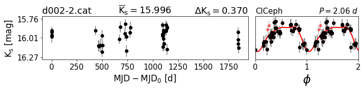


    ---------------------------------------------------------------------------------
    Nombre del catálogo:  d002-3.cat
    Catalogo:  177.2687043-64.0219149.lc
    amplitud: 0.363 [mag] 
    N° épocas:  36
    Magnitud media: 11.736 [mag]
    Periodo: 1.5520 [dias]
    Clase:  ClCeph


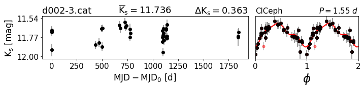


    ---------------------------------------------------------------------------------
    Nombre del catálogo:  d002-4.cat
    Catalogo:  177.36324213-64.05240015.lc
    amplitud: 0.461 [mag] 
    N° épocas:  40
    Magnitud media: 14.617 [mag]
    Periodo: 0.3682 [dias]
    Clase:  RRc


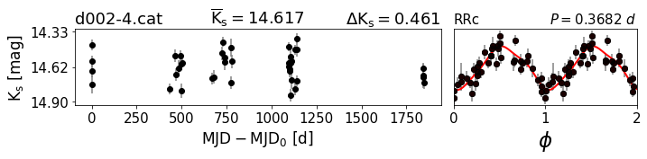


    ---------------------------------------------------------------------------------
    Nombre del catálogo:  d002-6.cat
    Catalogo:  177.59294775-63.58308676.lc
    amplitud: 0.379 [mag] 
    N° épocas:  41
    Magnitud media: 14.517 [mag]
    Periodo: 0.4590 [dias]
    Clase:  RRab


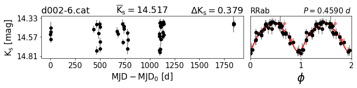


    ---------------------------------------------------------------------------------
    Nombre del catálogo:  d002-8.cat
    Catalogo:  177.63856941-63.96145541.lc
    amplitud: 0.645 [mag] 
    N° épocas:  40
    Magnitud media: 13.550 [mag]
    Periodo: 0.2927 [dias]
    Clase:  RRc


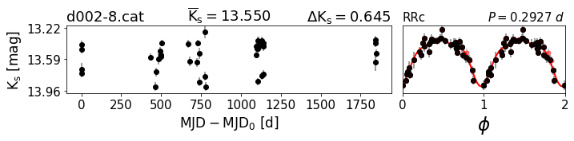


    ---------------------------------------------------------------------------------
    Nombre del catálogo:  d002-9.cat
    Catalogo:  177.67023376-63.39632512.lc
    amplitud: 0.459 [mag] 
    N° épocas:  39
    Magnitud media: 13.326 [mag]
    Periodo: 1.0637 [dias]
    Clase:  Binary


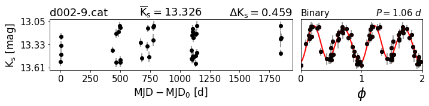


    ---------------------------------------------------------------------------------
    Nombre del catálogo:  d002-10.cat
    Catalogo:  177.67329455-63.61808709.lc
    amplitud: 0.339 [mag] 
    N° épocas:  41
    Magnitud media: 14.118 [mag]
    Periodo: 0.3939 [dias]
    Clase:  RRc


    ---------------------------------------------------------------------------------
    Nombre del catálogo:  d002-11.cat
    Catalogo:  177.69359178-63.7126028.lc
    amplitud: 0.348 [mag] 
    N° épocas:  41
    Magnitud media: 13.278 [mag]
    Periodo: 0.7827 [dias]
    Clase:  RRab


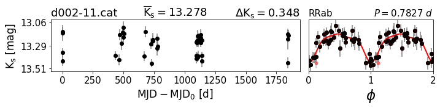


    ---------------------------------------------------------------------------------
    Nombre del catálogo:  d002-12.cat
    Catalogo:  177.72592958-63.44148124.lc
    amplitud: 0.411 [mag] 
    N° épocas:  41
    Magnitud media: 14.405 [mag]
    Periodo: 0.2367 [dias]
    Clase:  RRc


    ---------------------------------------------------------------------------------
    Nombre del catálogo:  d002-13.cat
    Catalogo:  177.73565596-63.66999068.lc
    amplitud: 0.494 [mag] 
    N° épocas:  39
    Magnitud media: 15.018 [mag]
    Periodo: 0.4379 [dias]
    Clase:  Binary


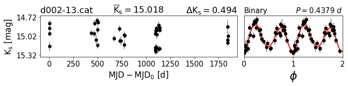


    ---------------------------------------------------------------------------------
    Nombre del catálogo:  d002-14.cat
    Catalogo:  177.7396756-63.50347969.lc
    amplitud: 0.417 [mag] 
    N° épocas:  40
    Magnitud media: 13.996 [mag]
    Periodo: 1.8616 [dias]
    Clase:  Binary


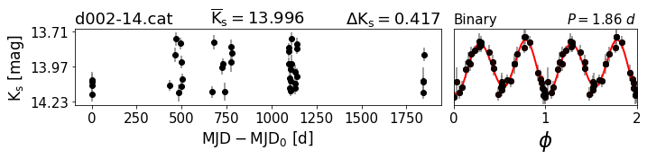


    ---------------------------------------------------------------------------------
    Nombre del catálogo:  d002-15.cat
    Catalogo:  177.76203646-64.06754902.lc
    amplitud: 0.397 [mag] 
    N° épocas:  39
    Magnitud media: 14.826 [mag]
    Periodo: 0.5232 [dias]
    Clase:  RRab


    ---------------------------------------------------------------------------------
    Nombre del catálogo:  d002-17.cat
    Catalogo:  177.7872961-63.58455426.lc
    amplitud: 0.456 [mag] 
    N° épocas:  40
    Magnitud media: 14.809 [mag]
    Periodo: 0.2502 [dias]
    Clase:  RRc


    ---------------------------------------------------------------------------------
    Nombre del catálogo:  d002-18.cat
    Catalogo:  177.79111849-63.26521157.lc
    amplitud: 0.346 [mag] 
    N° épocas:  41
    Magnitud media: 14.143 [mag]
    Periodo: 1.0783 [dias]
    Clase:  RRab


    ---------------------------------------------------------------------------------
    Nombre del catálogo:  d002-19.cat
    Catalogo:  177.8912883-63.80015468.lc
    amplitud: 0.517 [mag] 
    N° épocas:  40
    Magnitud media: 15.145 [mag]
    Periodo: 0.2028 [dias]
    Clase:  RRc


    ---------------------------------------------------------------------------------
    Nombre del catálogo:  d002-20.cat
    Catalogo:  177.98925222-64.01664726.lc
    amplitud: 0.429 [mag] 
    N° épocas:  39
    Magnitud media: 14.954 [mag]
    Periodo: 0.4568 [dias]
    Clase:  RRab


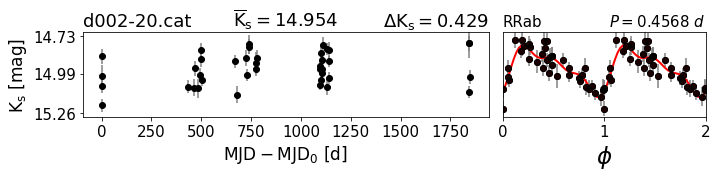


    ---------------------------------------------------------------------------------
    Nombre del catálogo:  d002-21.cat
    Catalogo:  177.99072357-63.23592689.lc
    amplitud: 0.671 [mag] 
    N° épocas:  39
    Magnitud media: 15.249 [mag]
    Periodo: 0.2499 [dias]
    Clase:  RRc


    ---------------------------------------------------------------------------------
    Nombre del catálogo:  d002-22.cat
    Catalogo:  178.06081671-63.28712.lc
    amplitud: 0.723 [mag] 
    N° épocas:  40
    Magnitud media: 13.098 [mag]
    Periodo: 1.5043 [dias]
    Clase:  Binary


    ---------------------------------------------------------------------------------
    Nombre del catálogo:  d002-23.cat
    Catalogo:  178.07093228-63.34926322.lc
    amplitud: 0.398 [mag] 
    N° épocas:  38
    Magnitud media: 14.452 [mag]
    Periodo: 0.2345 [dias]
    Clase:  RRc


    ---------------------------------------------------------------------------------
    Nombre del catálogo:  d002-24.cat
    Catalogo:  178.07152151-64.30726908.lc
    amplitud: 0.517 [mag] 
    N° épocas:  40
    Magnitud media: 13.289 [mag]
    Periodo: 0.3762 [dias]
    Clase:  RRc


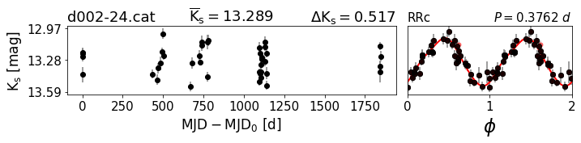


    ---------------------------------------------------------------------------------
    Nombre del catálogo:  d002-25.cat
    Catalogo:  178.16589903-63.61948702.lc
    amplitud: 0.336 [mag] 
    N° épocas:  39
    Magnitud media: 14.492 [mag]
    Periodo: 0.3450 [dias]
    Clase:  RRc


    ---------------------------------------------------------------------------------
    Nombre del catálogo:  d002-26.cat
    Catalogo:  178.24038096-64.08891333.lc
    amplitud: 0.588 [mag] 
    N° épocas:  41
    Magnitud media: 15.625 [mag]
    Periodo: 0.3729 [dias]
    Clase:  Binary


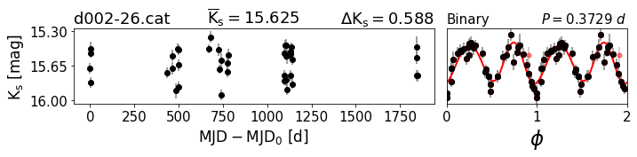


    ---------------------------------------------------------------------------------
    Nombre del catálogo:  d002-27.cat
    Catalogo:  178.24792933-64.02692664.lc
    amplitud: 0.273 [mag] 
    N° épocas:  41
    Magnitud media: 14.308 [mag]
    Periodo: 0.2209 [dias]
    Clase:  RRc


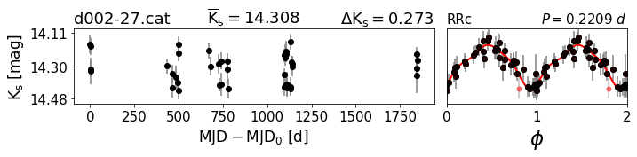


    ---------------------------------------------------------------------------------
    Nombre del catálogo:  d002-30.cat
    Catalogo:  178.36133957-63.64521183.lc
    amplitud: 0.705 [mag] 
    N° épocas:  41
    Magnitud media: 13.994 [mag]
    Periodo: 429.8790 [dias]
    Clase:  LPV


    ---------------------------------------------------------------------------------
    Nombre del catálogo:  d002-31.cat
    Catalogo:  178.3669735-63.64319967.lc
    amplitud: 1.250 [mag] 
    N° épocas:  40
    Magnitud media: 14.635 [mag]
    Periodo: 119.1170 [dias]
    Clase:  LPV-YSO


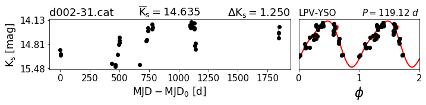


    ---------------------------------------------------------------------------------
    Nombre del catálogo:  d002-32.cat
    Catalogo:  178.37354572-64.09002704.lc
    amplitud: 0.314 [mag] 
    N° épocas:  40
    Magnitud media: 13.352 [mag]
    Periodo: 0.9021 [dias]
    Clase:  RRab


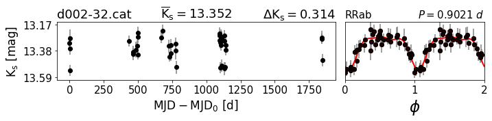


    ---------------------------------------------------------------------------------
    Nombre del catálogo:  d002-34.cat
    Catalogo:  178.40763057-64.06524221.lc
    amplitud: 0.755 [mag] 
    N° épocas:  40
    Magnitud media: 15.152 [mag]
    Periodo: 0.2954 [dias]
    Clase:  Binary


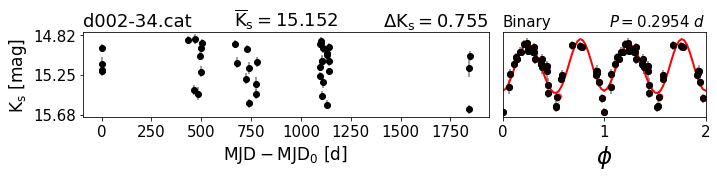


    ---------------------------------------------------------------------------------
    Nombre del catálogo:  d002-37.cat
    Catalogo:  178.50137317-63.64717396.lc
    amplitud: 0.336 [mag] 
    N° épocas:  39
    Magnitud media: 14.020 [mag]
    Periodo: 0.4919 [dias]
    Clase:  RRab


    ---------------------------------------------------------------------------------
    Nombre del catálogo:  d002-38.cat
    Catalogo:  178.50975825-63.26916069.lc
    amplitud: 0.487 [mag] 
    N° épocas:  38
    Magnitud media: 14.326 [mag]
    Periodo: 2.6013 [dias]
    Clase:  ClCeph


    ---------------------------------------------------------------------------------
    Nombre del catálogo:  d002-39.cat
    Catalogo:  178.52431092-63.35723562.lc
    amplitud: 0.315 [mag] 
    N° épocas:  38
    Magnitud media: 13.958 [mag]
    Periodo: 0.4439 [dias]
    Clase:  RRab


    ---------------------------------------------------------------------------------
    Nombre del catálogo:  d002-40.cat
    Catalogo:  178.52452665-63.5983637.lc
    amplitud: 0.387 [mag] 
    N° épocas:  40
    Magnitud media: 15.154 [mag]
    Periodo: 0.6003 [dias]
    Clase:  RRab


    ---------------------------------------------------------------------------------
    Nombre del catálogo:  d002-41.cat
    Catalogo:  178.53032871-63.81514462.lc
    amplitud: 0.817 [mag] 
    N° épocas:  40
    Magnitud media: 15.934 [mag]
    Periodo: 0.3220 [dias]
    Clase:  Binary


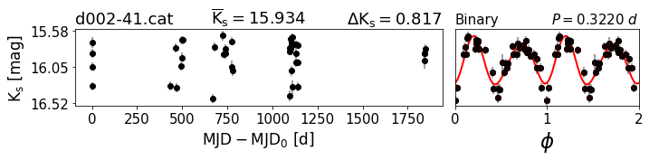


    ---------------------------------------------------------------------------------
    Nombre del catálogo:  d002-42.cat
    Catalogo:  178.53479648-63.37784406.lc
    amplitud: 0.481 [mag] 
    N° épocas:  40
    Magnitud media: 14.959 [mag]
    Periodo: 0.3238 [dias]
    Clase:  Binary


    ---------------------------------------------------------------------------------
    Nombre del catálogo:  d002-45.cat
    Catalogo:  178.62087896-63.84819116.lc
    amplitud: 0.512 [mag] 
    N° épocas:  41
    Magnitud media: 15.266 [mag]
    Periodo: 0.3876 [dias]
    Clase:  Binary


    ---------------------------------------------------------------------------------
    Nombre del catálogo:  d002-46.cat
    Catalogo:  178.65541403-63.59106458.lc
    amplitud: 0.273 [mag] 
    N° épocas:  41
    Magnitud media: 15.196 [mag]
    Periodo: 0.5528 [dias]
    Clase:  RRab


    ---------------------------------------------------------------------------------
    Nombre del catálogo:  d002-47.cat
    Catalogo:  178.66367992-63.68307178.lc
    amplitud: 0.473 [mag] 
    N° épocas:  41
    Magnitud media: 14.851 [mag]
    Periodo: 0.5600 [dias]
    Clase:  RRab


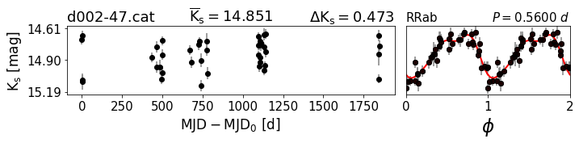


    ---------------------------------------------------------------------------------
    Nombre del catálogo:  d002-52.cat
    Catalogo:  178.805654-63.85499869.lc
    amplitud: 0.405 [mag] 
    N° épocas:  41
    Magnitud media: 13.783 [mag]
    Periodo: 0.2098 [dias]
    Clase:  RRc


    ---------------------------------------------------------------------------------
    Nombre del catálogo:  d002-53.cat
    Catalogo:  178.82210374-63.28254332.lc
    amplitud: 0.358 [mag] 
    N° épocas:  37
    Magnitud media: 11.989 [mag]
    Periodo: 1.2225 [dias]
    Clase:  ClCeph


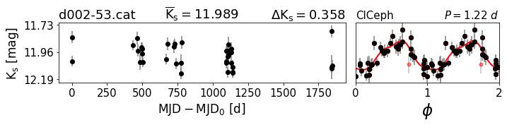


    ---------------------------------------------------------------------------------
    Nombre del catálogo:  d002-54.cat
    Catalogo:  178.82584768-63.56574861.lc
    amplitud: 0.495 [mag] 
    N° épocas:  41
    Magnitud media: 15.287 [mag]
    Periodo: 0.7287 [dias]
    Clase:  Binary


    ---------------------------------------------------------------------------------
    Nombre del catálogo:  d002-55.cat
    Catalogo:  178.83648763-63.34945447.lc
    amplitud: 0.781 [mag] 
    N° épocas:  40
    Magnitud media: 16.310 [mag]
    Periodo: 693.4090 [dias]
    Clase:  LPV


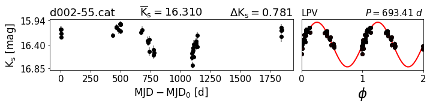


    ---------------------------------------------------------------------------------
    Nombre del catálogo:  d002-56.cat
    Catalogo:  178.87505598-63.35159512.lc
    amplitud: 0.480 [mag] 
    N° épocas:  39
    Magnitud media: 14.786 [mag]
    Periodo: 0.2177 [dias]
    Clase:  RRc


    ---------------------------------------------------------------------------------
    Nombre del catálogo:  d002-57.cat
    Catalogo:  178.89084628-63.34358907.lc
    amplitud: 0.376 [mag] 
    N° épocas:  41
    Magnitud media: 15.042 [mag]
    Periodo: 265.3000 [dias]
    Clase:  LPV


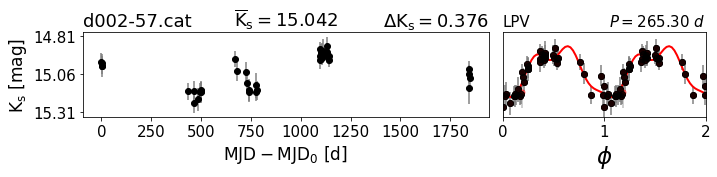


    ---------------------------------------------------------------------------------
    Nombre del catálogo:  d002-58.cat
    Catalogo:  178.92759855-63.29732155.lc
    amplitud: 0.347 [mag] 
    N° épocas:  40
    Magnitud media: 15.089 [mag]
    Periodo: 0.5899 [dias]
    Clase:  Binary


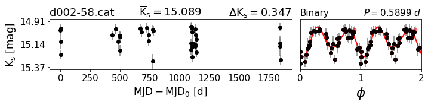


    ---------------------------------------------------------------------------------
    Nombre del catálogo:  d002-59.cat
    Catalogo:  179.05797082-64.09973208.lc
    amplitud: 0.426 [mag] 
    N° épocas:  41
    Magnitud media: 13.777 [mag]
    Periodo: 0.4545 [dias]
    Clase:  RRab


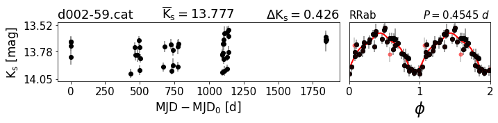


    ---------------------------------------------------------------------------------
    Nombre del catálogo:  d002-60.cat
    Catalogo:  179.06804611-63.36563411.lc
    amplitud: 0.343 [mag] 
    N° épocas:  40
    Magnitud media: 13.097 [mag]
    Periodo: 0.4010 [dias]
    Clase:  RRab


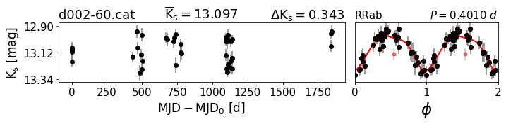


    ---------------------------------------------------------------------------------
    Nombre del catálogo:  d002-63.cat
    Catalogo:  179.1764039-63.86622941.lc
    amplitud: 0.590 [mag] 
    N° épocas:  41
    Magnitud media: 15.177 [mag]
    Periodo: 0.3223 [dias]
    Clase:  RRc


    ---------------------------------------------------------------------------------
    Nombre del catálogo:  d002-66.cat
    Catalogo:  179.29814653-64.21275412.lc
    amplitud: 0.467 [mag] 
    N° épocas:  41
    Magnitud media: 15.365 [mag]
    Periodo: 0.3212 [dias]
    Clase:  RRc


    ---------------------------------------------------------------------------------
    Nombre del catálogo:  d002-67.cat
    Catalogo:  179.30105823-64.40477779.lc
    amplitud: 0.490 [mag] 
    N° épocas:  40
    Magnitud media: 15.090 [mag]
    Periodo: 0.6754 [dias]
    Clase:  RRab


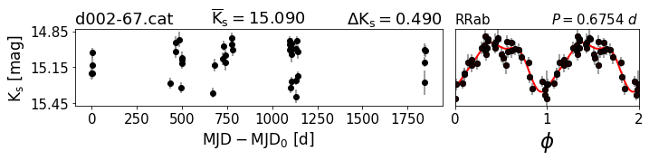


    ---------------------------------------------------------------------------------
    Nombre del catálogo:  d002-68.cat
    Catalogo:  179.32301566-64.20948857.lc
    amplitud: 0.423 [mag] 
    N° épocas:  39
    Magnitud media: 14.484 [mag]
    Periodo: 0.5810 [dias]
    Clase:  RRab


    ---------------------------------------------------------------------------------
    Nombre del catálogo:  d002-69.cat
    Catalogo:  179.32928697-63.34701702.lc
    amplitud: 0.506 [mag] 
    N° épocas:  40
    Magnitud media: 14.087 [mag]
    Periodo: 0.4029 [dias]
    Clase:  RRab


    ---------------------------------------------------------------------------------
    Nombre del catálogo:  d002-70.cat
    Catalogo:  179.34669374-63.33083179.lc
    amplitud: 0.576 [mag] 
    N° épocas:  40
    Magnitud media: 15.092 [mag]
    Periodo: 0.2690 [dias]
    Clase:  RRc


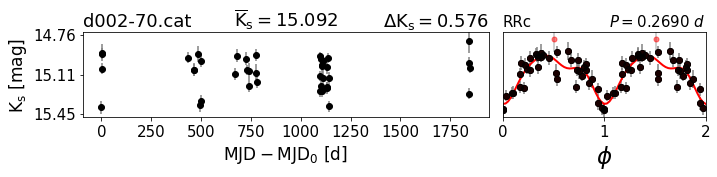


    ---------------------------------------------------------------------------------
    Nombre del catálogo:  d002-71.cat
    Catalogo:  179.34885349-64.04781598.lc
    amplitud: 0.424 [mag] 
    N° épocas:  40
    Magnitud media: 14.198 [mag]
    Periodo: 0.5611 [dias]
    Clase:  RRab


    ---------------------------------------------------------------------------------
    Nombre del catálogo:  d002-72.cat
    Catalogo:  179.37842684-63.56055753.lc
    amplitud: 0.456 [mag] 
    N° épocas:  40
    Magnitud media: 14.710 [mag]
    Periodo: 851.6990 [dias]
    Clase:  LPV


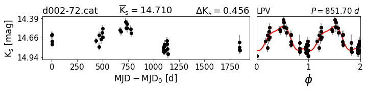


    ---------------------------------------------------------------------------------
    Nombre del catálogo:  d002-74.cat
    Catalogo:  179.43148039-63.71364523.lc
    amplitud: 0.684 [mag] 
    N° épocas:  41
    Magnitud media: 15.485 [mag]
    Periodo: 834.2910 [dias]
    Clase:  LPV


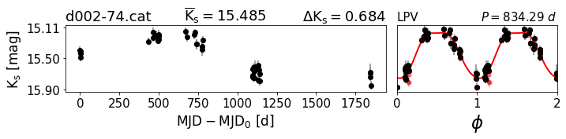


    ---------------------------------------------------------------------------------
    Nombre del catálogo:  d002-75.cat
    Catalogo:  179.44822281-63.70091603.lc
    amplitud: 0.324 [mag] 
    N° épocas:  37
    Magnitud media: 11.287 [mag]
    Periodo: 1.8895 [dias]
    Clase:  ClCeph


    ---------------------------------------------------------------------------------
    Nombre del catálogo:  d002-78.cat
    Catalogo:  179.50173517-64.34747143.lc
    amplitud: 0.433 [mag] 
    N° épocas:  41
    Magnitud media: 13.855 [mag]
    Periodo: 0.3477 [dias]
    Clase:  Binary


    ---------------------------------------------------------------------------------
    Nombre del catálogo:  d002-81.cat
    Catalogo:  179.67224045-64.0619468.lc
    amplitud: 0.414 [mag] 
    N° épocas:  40
    Magnitud media: 15.097 [mag]
    Periodo: 0.3330 [dias]
    Clase:  Binary


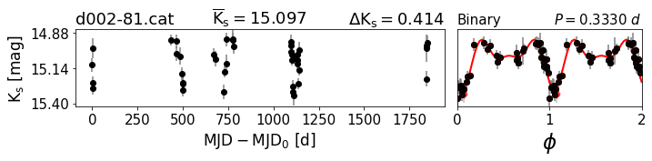


    ---------------------------------------------------------------------------------
    Nombre del catálogo:  d002-82.cat
    Catalogo:  179.68109242-63.91870055.lc
    amplitud: 0.347 [mag] 
    N° épocas:  41
    Magnitud media: 14.306 [mag]
    Periodo: 0.3593 [dias]
    Clase:  Binary


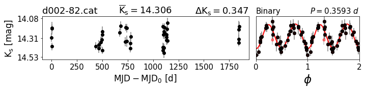


    ---------------------------------------------------------------------------------
    Nombre del catálogo:  d002-83.cat
    Catalogo:  179.70523188-63.44440327.lc
    amplitud: 0.449 [mag] 
    N° épocas:  41
    Magnitud media: 14.133 [mag]
    Periodo: 0.3333 [dias]
    Clase:  RRc


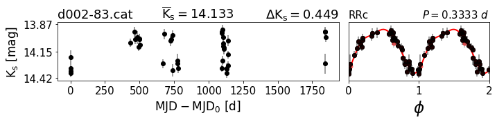


    ---------------------------------------------------------------------------------
    Nombre del catálogo:  d002-84.cat
    Catalogo:  179.70524776-63.77184016.lc
    amplitud: 0.502 [mag] 
    N° épocas:  40
    Magnitud media: 14.748 [mag]
    Periodo: 1.1128 [dias]
    Clase:  Binary


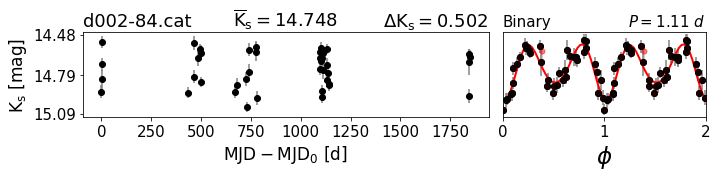


    ---------------------------------------------------------------------------------
    Nombre del catálogo:  d002-85.cat
    Catalogo:  179.74803716-64.48081344.lc
    amplitud: 0.336 [mag] 
    N° épocas:  30
    Magnitud media: 14.913 [mag]
    Periodo: 0.2650 [dias]
    Clase:  RRc


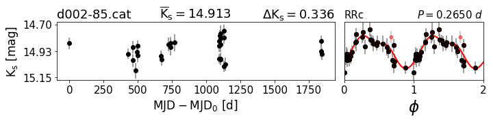


    ---------------------------------------------------------------------------------
    Nombre del catálogo:  d002-86.cat
    Catalogo:  179.81109637-64.50287982.lc
    amplitud: 0.313 [mag] 
    N° épocas:  31
    Magnitud media: 15.315 [mag]
    Periodo: 0.3037 [dias]
    Clase:  RRc


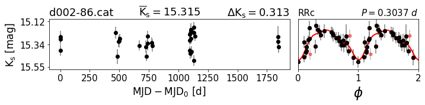


    ---------------------------------------------------------------------------------
    Nombre del catálogo:  d002-89.cat
    Catalogo:  179.88526159-64.08081749.lc
    amplitud: 0.596 [mag] 
    N° épocas:  41
    Magnitud media: 13.963 [mag]
    Periodo: 0.3240 [dias]
    Clase:  RRc


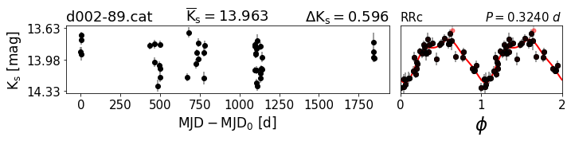


    ---------------------------------------------------------------------------------
    Nombre del catálogo:  d002-90.cat
    Catalogo:  179.88765907-63.43318271.lc
    amplitud: 0.588 [mag] 
    N° épocas:  38
    Magnitud media: 15.213 [mag]
    Periodo: 141.0830 [dias]
    Clase:  LPV-YSO


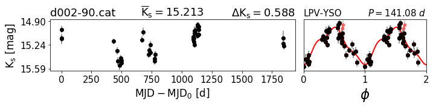


    ---------------------------------------------------------------------------------
    Nombre del catálogo:  d002-91.cat
    Catalogo:  179.94345483-63.87327227.lc
    amplitud: 0.693 [mag] 
    N° épocas:  39
    Magnitud media: 14.752 [mag]
    Periodo: 0.3660 [dias]
    Clase:  Binary


    ---------------------------------------------------------------------------------
    Nombre del catálogo:  d002-92.cat
    Catalogo:  180.02571036-63.91772577.lc
    amplitud: 0.389 [mag] 
    N° épocas:  40
    Magnitud media: 14.829 [mag]
    Periodo: 0.7078 [dias]
    Clase:  Binary


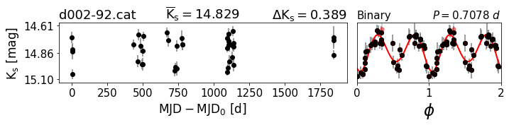


    ---------------------------------------------------------------------------------
    Nombre del catálogo:  d002-93.cat
    Catalogo:  180.03934571-63.96909528.lc
    amplitud: 0.483 [mag] 
    N° épocas:  40
    Magnitud media: 14.794 [mag]
    Periodo: 0.3890 [dias]
    Clase:  Binary


    ---------------------------------------------------------------------------------
    Nombre del catálogo:  d002-95.cat
    Catalogo:  180.08633817-63.83746057.lc
    amplitud: 0.535 [mag] 
    N° épocas:  41
    Magnitud media: 14.873 [mag]
    Periodo: 0.3074 [dias]
    Clase:  RRc


    ---------------------------------------------------------------------------------
    Nombre del catálogo:  d002-96.cat
    Catalogo:  180.10270004-64.07028275.lc
    amplitud: 0.539 [mag] 
    N° épocas:  41
    Magnitud media: 15.143 [mag]
    Periodo: 0.2881 [dias]
    Clase:  RRc


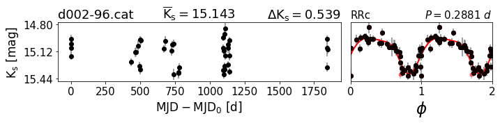


    ---------------------------------------------------------------------------------
    Nombre del catálogo:  d002-97.cat
    Catalogo:  180.10804436-64.07668703.lc
    amplitud: 0.479 [mag] 
    N° épocas:  36
    Magnitud media: 15.656 [mag]
    Periodo: 0.6879 [dias]
    Clase:  Binary


    ---------------------------------------------------------------------------------
    Nombre del catálogo:  d002-98.cat
    Catalogo:  180.42133606-63.68832316.lc
    amplitud: 0.258 [mag] 
    N° épocas:  40
    Magnitud media: 14.741 [mag]
    Periodo: 0.2096 [dias]
    Clase:  RRc


    ---------------------------------------------------------------------------------
    Nombre del catálogo:  d002-99.cat
    Catalogo:  180.45848371-63.83627702.lc
    amplitud: 0.537 [mag] 
    N° épocas:  41
    Magnitud media: 15.050 [mag]
    Periodo: 0.3790 [dias]
    Clase:  RRc


    ---------------------------------------------------------------------------------
    Nombre del catálogo:  d002-100.cat
    Catalogo:  180.49468671-63.65158667.lc
    amplitud: 0.499 [mag] 
    N° épocas:  39
    Magnitud media: 16.006 [mag]
    Periodo: 5.0350 [dias]
    Clase:  ClCeph


    ---------------------------------------------------------------------------------
    Nombre del catálogo:  d002-101.cat
    Catalogo:  180.56713046-64.22996616.lc
    amplitud: 0.299 [mag] 
    N° épocas:  40
    Magnitud media: 12.916 [mag]
    Periodo: 7.7740 [dias]
    Clase:  ClCeph


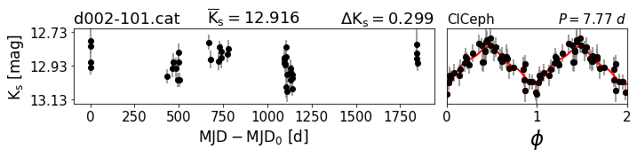


    ---------------------------------------------------------------------------------
    Nombre del catálogo:  d002-102.cat
    Catalogo:  180.57272103-63.93843851.lc
    amplitud: 0.569 [mag] 
    N° épocas:  41
    Magnitud media: 14.178 [mag]
    Periodo: 11.2626 [dias]
    Clase:  Binary


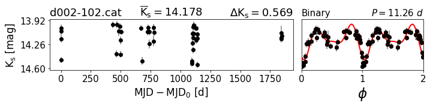


    ---------------------------------------------------------------------------------
    Nombre del catálogo:  d002-103.cat
    Catalogo:  180.65195427-63.89832057.lc
    amplitud: 2.310 [mag] 
    N° épocas:  41
    Magnitud media: 14.286 [mag]
    Periodo: 569.5680 [dias]
    Clase:  LPV


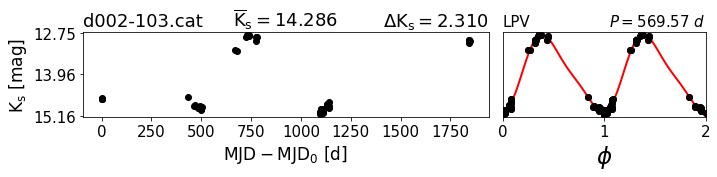


    ---------------------------------------------------------------------------------
    Nombre del catálogo:  d002-104.cat
    Catalogo:  180.70518325-63.87673295.lc
    amplitud: 0.434 [mag] 
    N° épocas:  41
    Magnitud media: 12.939 [mag]
    Periodo: 0.5490 [dias]
    Clase:  RRab


    ---------------------------------------------------------------------------------
    Nombre del catálogo:  d002-105.cat
    Catalogo:  180.70954492-63.6902734.lc
    amplitud: 0.370 [mag] 
    N° épocas:  41
    Magnitud media: 14.425 [mag]
    Periodo: 0.2188 [dias]
    Clase:  RRc


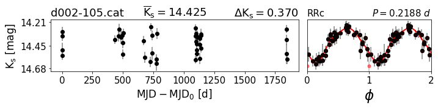


    ---------------------------------------------------------------------------------
    Nombre del catálogo:  d002-106.cat
    Catalogo:  180.77312185-63.80279204.lc
    amplitud: 0.405 [mag] 
    N° épocas:  41
    Magnitud media: 14.298 [mag]
    Periodo: 0.7197 [dias]
    Clase:  RRab


    ---------------------------------------------------------------------------------
    Nombre del catálogo:  d002-107.cat
    Catalogo:  180.7785658-63.81441739.lc
    amplitud: 0.395 [mag] 
    N° épocas:  41
    Magnitud media: 14.269 [mag]
    Periodo: 0.2697 [dias]
    Clase:  Binary


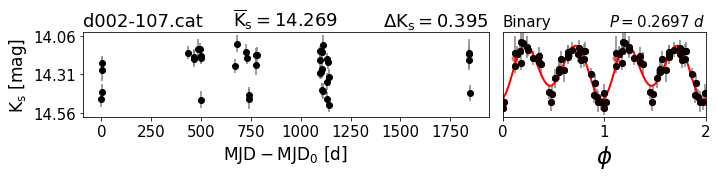


    ---------------------------------------------------------------------------------
    Nombre del catálogo:  d002-108.cat
    Catalogo:  180.88372089-63.55488383.lc
    amplitud: 0.299 [mag] 
    N° épocas:  39
    Magnitud media: 14.060 [mag]
    Periodo: 7.9050 [dias]
    Clase:  ClCeph


# Fuentes Irregulares:


```python
#Camino a las curvas:
path=camino_principal+tile

for i in range(len(ID_non)):
    
    mjd,mag,err = Readlc(ID_non[i], path=path)

    print '---------------------------------------------------------------------------------'
    #print cat_path
    print "Nombre del catálogo: ",ID_non[i]
    print "amplitud: %0.3f [mag] " %(max(mag)-min(mag))
    print "N° épocas: ",len(mag)
    print "Magnitud media: %0.3f [mag]" %np.mean(mag)
    print "Clase: ", Classes_non[i]    
    
    var_non_regular(mjd,mag,err,size=(8,2.5),name=Classes_non[i] ,ms=10,mjd0=None)        
    plt.show()
```

    ---------------------------------------------------------------------------------
    Nombre del catálogo:  d002-5.cat
    amplitud: 0.669 [mag] 
    N° épocas:  40
    Magnitud media: 15.008 [mag]
    Clase:  STV


    ---------------------------------------------------------------------------------
    Nombre del catálogo:  d002-7.cat
    amplitud: 0.894 [mag] 
    N° épocas:  26
    Magnitud media: 11.261 [mag]
    Clase:  Unclass


    ---------------------------------------------------------------------------------
    Nombre del catálogo:  d002-16.cat
    amplitud: 1.295 [mag] 
    N° épocas:  29
    Magnitud media: 14.354 [mag]
    Clase:  STV


    ---------------------------------------------------------------------------------
    Nombre del catálogo:  d002-28.cat
    amplitud: 0.649 [mag] 
    N° épocas:  37
    Magnitud media: 13.892 [mag]
    Clase:  Fader


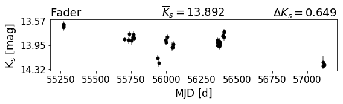


    ---------------------------------------------------------------------------------
    Nombre del catálogo:  d002-29.cat
    amplitud: 0.825 [mag] 
    N° épocas:  41
    Magnitud media: 15.668 [mag]
    Clase:  Dipper


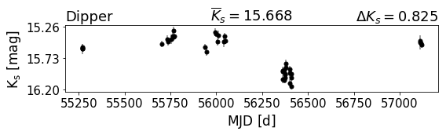


    ---------------------------------------------------------------------------------
    Nombre del catálogo:  d002-33.cat
    amplitud: 1.082 [mag] 
    N° épocas:  35
    Magnitud media: 16.174 [mag]
    Clase:  Unclass


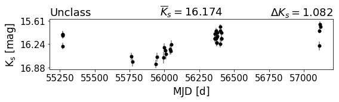


    ---------------------------------------------------------------------------------
    Nombre del catálogo:  d002-35.cat
    amplitud: 1.759 [mag] 
    N° épocas:  39
    Magnitud media: 13.021 [mag]
    Clase:  Eruptive


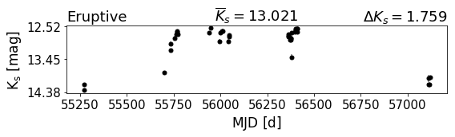


    ---------------------------------------------------------------------------------
    Nombre del catálogo:  d002-36.cat
    amplitud: 1.124 [mag] 
    N° épocas:  41
    Magnitud media: 15.707 [mag]
    Clase:  Eruptive


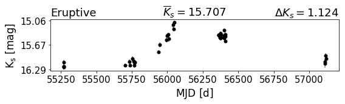


    ---------------------------------------------------------------------------------
    Nombre del catálogo:  d002-43.cat
    amplitud: 1.258 [mag] 
    N° épocas:  39
    Magnitud media: 12.798 [mag]
    Clase:  Dipper


    ---------------------------------------------------------------------------------
    Nombre del catálogo:  d002-44.cat
    amplitud: 2.334 [mag] 
    N° épocas:  38
    Magnitud media: 14.194 [mag]
    Clase:  Eruptive


    ---------------------------------------------------------------------------------
    Nombre del catálogo:  d002-48.cat
    amplitud: 1.113 [mag] 
    N° épocas:  41
    Magnitud media: 12.398 [mag]
    Clase:  Eruptive


    ---------------------------------------------------------------------------------
    Nombre del catálogo:  d002-49.cat
    amplitud: 0.803 [mag] 
    N° épocas:  40
    Magnitud media: 14.413 [mag]
    Clase:  Unclass


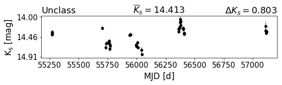


    ---------------------------------------------------------------------------------
    Nombre del catálogo:  d002-50.cat
    amplitud: 1.058 [mag] 
    N° épocas:  38
    Magnitud media: 15.698 [mag]
    Clase:  STV


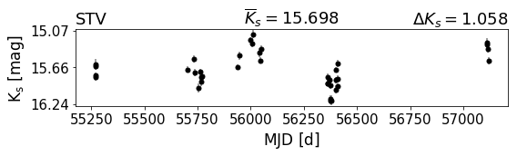


    ---------------------------------------------------------------------------------
    Nombre del catálogo:  d002-51.cat
    amplitud: 0.780 [mag] 
    N° épocas:  39
    Magnitud media: 13.033 [mag]
    Clase:  Unclass


    ---------------------------------------------------------------------------------
    Nombre del catálogo:  d002-61.cat
    amplitud: 0.997 [mag] 
    N° épocas:  37
    Magnitud media: 14.734 [mag]
    Clase:  Unclass


    ---------------------------------------------------------------------------------
    Nombre del catálogo:  d002-62.cat
    amplitud: 2.140 [mag] 
    N° épocas:  26
    Magnitud media: 15.023 [mag]
    Clase:  Unclass


    ---------------------------------------------------------------------------------
    Nombre del catálogo:  d002-64.cat
    amplitud: 1.724 [mag] 
    N° épocas:  35
    Magnitud media: 16.008 [mag]
    Clase:  Fader


    ---------------------------------------------------------------------------------
    Nombre del catálogo:  d002-65.cat
    amplitud: 0.848 [mag] 
    N° épocas:  37
    Magnitud media: 14.946 [mag]
    Clase:  Unclass


    ---------------------------------------------------------------------------------
    Nombre del catálogo:  d002-73.cat
    amplitud: 0.756 [mag] 
    N° épocas:  38
    Magnitud media: 15.116 [mag]
    Clase:  LAE


    ---------------------------------------------------------------------------------
    Nombre del catálogo:  d002-76.cat
    amplitud: 0.727 [mag] 
    N° épocas:  41
    Magnitud media: 13.149 [mag]
    Clase:  LAE


    ---------------------------------------------------------------------------------
    Nombre del catálogo:  d002-77.cat
    amplitud: 3.050 [mag] 
    N° épocas:  34
    Magnitud media: 15.610 [mag]
    Clase:  Pmotion


    ---------------------------------------------------------------------------------
    Nombre del catálogo:  d002-79.cat
    amplitud: 1.044 [mag] 
    N° épocas:  26
    Magnitud media: 15.830 [mag]
    Clase:  Unclass


    ---------------------------------------------------------------------------------
    Nombre del catálogo:  d002-80.cat
    amplitud: 1.152 [mag] 
    N° épocas:  40
    Magnitud media: 13.705 [mag]
    Clase:  Fader


    ---------------------------------------------------------------------------------
    Nombre del catálogo:  d002-87.cat
    amplitud: 0.965 [mag] 
    N° épocas:  39
    Magnitud media: 15.807 [mag]
    Clase:  STV


    ---------------------------------------------------------------------------------
    Nombre del catálogo:  d002-88.cat
    amplitud: 1.152 [mag] 
    N° épocas:  40
    Magnitud media: 14.653 [mag]
    Clase:  Dipper


    ---------------------------------------------------------------------------------
    Nombre del catálogo:  d002-94.cat
    amplitud: 0.670 [mag] 
    N° épocas:  41
    Magnitud media: 14.961 [mag]
    Clase:  LAE


# Holi, gracias por ver mis estrellitas :)
