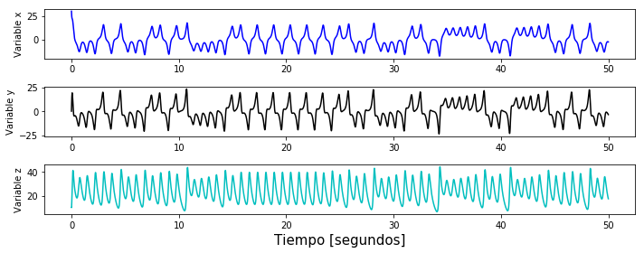
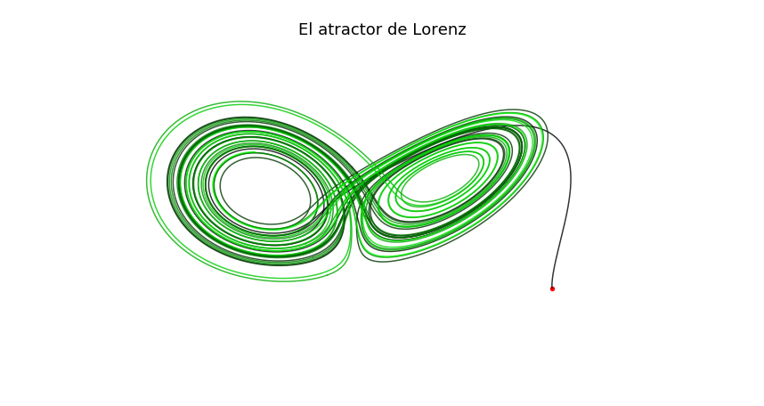
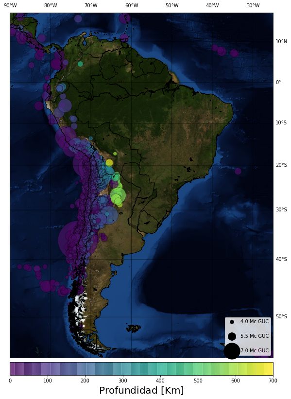

# Motivación

Hace bastante tiempo quería explicar el por qué creo que programar es importante como una manera de estructurar e implementar el pensamiento lógico. Comprender sus aplicaciones nos habilita a entender diferentes aspectos de nuestra realidad. Con sus herramientas uno podría, por sólo dar ejemplos, construir y reproducir experimentos científicos, estudiar bases de datos para llegar a conclusiones y exhibirlas de una manera comprensible. 

Dominar en algún nivel sus herramienta es fundamental en la actualidad, no sólo para las personas relacionadas a la ciencias e ingeniería sino también para aquellos que se interesan en la búsqueda, visualización e interpretación de diversas bases de datos, como periodistas y/o psicólogos. 

Creo que al adquirir el punto de vista de la implementación y flujo de cálculos matemáticos, tomé perspectiva del potencial de programar un sistema. Además si nos ponemos románticos, podríamos decir que programar es como crear un pequeño mundo, el cual sigue las reglas asignadas por el escritor sin excepción alguna. 

Gran parte de estas técnicas de análisis se desarrollaron originalmente usando lógica y cálculos matemáticos complejos, los cuales fueron potenciados con la aparición de computadores capaces de optimizar operaciones, automatizar procesos y realizar cálculos sostenidos a través del tiempo. Hoy en día, el acceso a este tipo de análisis es bastante transversal en comparación al siglo pasado, básicamente es necesario una computadora personal o smartphone, acceso a internet, los datos a analizar y simpatía por el idioma inglés. 

Hay toda clase de tutoriales en internet con los cuales uno puede aprender de manera autodidacta sobre variadas temáticas, lenguajes de programación y futuras aplicaciones. Yo aquí recolectaré y daré un espacio a lo interesante que todo esto podría llegar a ser.

## Python como primer lenguaje 

Como sistema de comunicación, la lógica computacional puede ser descrita y comunicada a través de  diferentes idiomas, los cuales son denominados lenguajes de programación. El criterio para elegir uno de ellos pueden ser variados, como la velocidad de ejecución u entorno de desarrollo. 

Python es un lenguaje apropiado para aprender de cero a implementar código de manera simple, ya que posee una sintaxis simple y directa lo que conlleva una fácil interpretación para el usuario. Varías estadísticas revelan que Python ha crecido exponencialmente en términos de usuarios en los últimos años. Esto alienta a la creación de librerías especializadas y de carácter libre.

Daré algunos ejemplos de lo que se puede hacer:

## El atractor de Lorenz:
El sistema de Lorenz es un set de ecuaciones diferenciales acopladas las cuales tiene soluciones caóticas dados ciertos parámetros $\sigma$, $\rho$ y $\beta$ con las condiciones iniciales $x(0)$, $y(0)$ y $z(0)$ evaluadas en la posición inicial de nuestra partícula P.

$$\displaystyle \frac{{\rm d}x}{{\rm d}t} = \sigma(y - x)$$

$$\displaystyle \frac{{\rm d}y}{{\rm d}t} = x(\rho - z) - y$$

$$\displaystyle \frac{{\rm d}z}{{\rm d}t} = xy - \beta z$$

El truco acá será discretizar los diferenciales del set de ecuaciones, asumiendo que el infinitesimal temporal ${\rm d}t$ puede ser aproximada usando una diferencia finita $\Delta t$ suficientemente pequeña. Lo mismo será asumido para las variables espaciales, así por ejemplo para la variable i-ésima $x_{i}$, tenemos que $\Delta x_{i+1} = x_{i+1} - x_{i}$. 

Dicho esto, nuestras ecuaciones toman la siguiente forma:

$${\rm d}x = \sigma(y - x){\rm d}t\ \ \ \ \ \ \ \Rightarrow\ \ \ \ \ \ \  x_{i+1}=x_{i}+\sigma (y_{i}-x_{i}) \Delta t$$

$${\rm d}y = (\rho x - z x - y){\rm d}t\ \ \ \ \ \ \ \ \ \Rightarrow\ \ \ \ \ \ \ \  y_{i+1}=y_{i}+(\rho x_{i} - z_{i} x_{i} - y_{i}) \Delta t$$ 

$${\rm d}z = (xy - \beta z){\rm d}t\ \ \ \ \ \ \ \  \Rightarrow\ \ \ \ \ \ \ \  z_{i+1}=z_{i}+(x_{i}y_{i}-\beta z_{i})\Delta t$$  

Así, pondremos una partícula de prueba en este mundo gobernado por estas tres leyes y evaluaremos su comportamiento usando 50 mil pequeños pasos $\Delta t$ para ver cómo evoluciona a través de 50 segundos. 

No se diga más!


```python
#Importamos las librerías que nos harán la vida fácil :)
%matplotlib inline
import numpy as np
import matplotlib.pyplot as plt
from mpl_toolkits.mplot3d import Axes3D
from mpl_toolkits.basemap import Basemap
import pandas as pd
```


```python
#Valores usuales para los parámetros de Lorenz 
sigma, beta, rho = 10, 2.667, 28

#Número de puntos a evaluar
npuntos = 50000

#Paso de tiempo:
dt = 0.001

#iniciamos vectores:
x = np.zeros(npuntos)
y = np.zeros(npuntos)
z = np.zeros(npuntos)
t = np.zeros(npuntos)

inicio_particula = (30,0,10)
x[0],y[0],z[0] = inicio_particula

#Aplicamos las leyes establecidas:
for i in range(npuntos-1):
    x[i+1] = x[i]+sigma*(y[i]-x[i])*dt
    y[i+1] = y[i]+(rho*x[i]-z[i]*x[i]-y[i])*dt
    z[i+1] = z[i]+(x[i]*y[i]-beta*z[i])*dt
    t[i+1] = t[i]+dt

#Empieza el plot:
plt.figure(figsize=(10,4))    

fz = 18
axes = 15

plt.subplot(311)
plt.plot(t,x,'b')
plt.ylabel('Variable x')

plt.subplot(312)
plt.plot(t,y,'k')
plt.ylabel('Variable y')

plt.subplot(313)
plt.plot(t,z,'c')
plt.xlabel('Tiempo [segundos]', fontsize=axes)
plt.ylabel('Variable z')
plt.tight_layout()
plt.show()

#Ploteamos el Atractor de Lorenz:
fig = plt.figure(figsize=(15,8))
ax = fig.gca(projection='3d')

#Pintamos la trayectoria de la particula de prueba:
segmentos = 1000
c = np.linspace(0,1,npuntos)
for i in range(0,npuntos-segmentos,segmentos):
    paso = i+segmentos
    ax.plot(x[i:paso], y[i:paso], z[i:paso], color=(0,c[i],0), alpha=0.8)

#Punto de inicio:
ax.scatter(inicio_particula[0],inicio_particula[1],inicio_particula[2],'o', color='red')    
ax.set_axis_off()
ax.set_title("El atractor de Lorenz",fontsize=fz)
plt.show()
```








Entonces, la partícula roja se ha desplazado acorde a las leyes de Lorenz, y ha trazado el comportamiento característico de este set de ecuaciones diferenciales, y por lo cual es frecuentemente llamado ***el Atractor de Lorenz***. El comportamiento individual de cada variable a través del tiempo puede ser consultado en los gráficos en la parte superior.


# Un mapa sismológico de Sudamérica

Si vives en Chile, probablemente te habrás dado cuenta que es un país muy sísmico. Tan solo en ésta década hemos tenidos varios terremotos con una magnitud sobre 7 en escala de [magnitud local](http://www.csn.uchile.cl/formulas-para-estimar-la-magnitud/){:target="_blank"}. Cada vez que hay un temblor, los memes vuelan e imploran que se presente Marcelo Lagos a dar el reporte, y hasta un trago se llama Terremoto. Entonces: ¿será verdad que en otras partes del mundo, esto de los sismos no es normal?

Esta pregunta podría ser resuelta si es que visualizamos cada evento registrado desde alguna fecha arbitraria y ver cómo estos se localizan a través de Sudamérica. Para saber esto, hemos consultado la base de datos de la pagina de [monitoreo sismológico de la Universidad de Chile](http://www.sismologia.cl/){:target="_blank"}, entre los años 2003 y 2015, obteniendo una lista con más de 58 mil sismos distribuidos a lo largo del continente.

Estos datos han sido recolectados en [este post](http://benjad.github.io/2015/08/21/base-de-datos-sismos-chile/){:target="_blank"} (usando otro lenguaje de programación :p) y crearemos un mapa con la distribución de sismos en Sudamérica entre el 2003 y 2015. 

Así nomás.


```python
#Leemos el archivo con los sismos
data = pd.read_csv("sismos.csv") 
#Vemos qué es lo que dicen las primeras lineas 
print data.head()
```

      Fecha localFecha UTC      Unnamed: 1  Latitud  Longitud  Profundidad_Km  \
    0       1/1/2003 16:26  1/1/2003 19:26  -34.710   -70.174             0.0   
    1       1/1/2003 14:22  1/1/2003 17:22  -35.112   -71.375            63.1   
    2       1/1/2003 14:02  1/1/2003 17:02  -31.051   -71.310            64.4   
    3       1/1/2003 13:25  1/1/2003 16:25  -30.159   -70.141             5.4   
    4       1/1/2003 12:54  1/1/2003 15:54  -32.138   -71.753            11.0   
    
                   Magnitud                  Referencia  
    0            3.1 Mc GUC  76 km al E de San Fernando  
    1  2.9 Mc GUC3.1 Ml GUC        44 km al NE de Talca  
    2  2.9 Mc GUC2.5 Ml GUC   33 km al NO de Combarbalá  
    3  3.3 Mc GUC2.7 Ml GUC        57 km al E de Vicuña  
    4  3.6 Mc GUC3.3 Ml GUC     60 km al NO de La Ligua  


```python
#Entendemos el archivo y le damos el formato adecuado para hacer los gráficos
Latitudes     = data['Latitud'].values
Longitudes    = data['Longitud'].values
Profundidades = data['Profundidad_Km'].values
Magnitudes    = data['Magnitud'].values

#Damos el formato a las magnitudes, esto es lo más fome así que ignórenlo.
Mag = np.array([Magnitudes[i].split()[0] for i in range(len(Magnitudes))])
Mags = np.zeros(len(Mag))

for i in range(len(Mag)):
    if Mag[i] == "''":
        Mags[i] = 0
    else:
        Mags[i] = float(Mag[i])
```


```python
#Límites de latitud:
x1 = -90.
x2 = -25.

#Límites de longuitud:
y1 = -56.
y2 = 17.    
    
m = Basemap(resolution='h',projection='merc',llcrnrlat=y1,urcrnrlat=y2,llcrnrlon=x1,urcrnrlon=x2,lat_ts=(x1+x2)/2.)
plt.figure(figsize=(8,13))

#Lineas fronterizas de los países
m.drawcoastlines(linewidth=1)
m.drawcountries(linewidth=1)

#Color del mapa del fondo:
m.bluemarble()

#Meridianos y paralelos:
m.drawmeridians(np.arange(0,360,10),labels=[False,True,True,False])
m.drawparallels(np.arange(-90,90,10),labels=[False,True,True,False])

#Mapeamos las coordenadas:
x,y = m(Longitudes, Latitudes)
m.scatter(x, y, s=np.exp(Mags), c=Profundidades,alpha=0.7, edgecolors='black', linewidth=0.45)
cbar = plt.colorbar(orientation='horizontal',pad=0.01)
cbar.set_label(r'${\rm Profundidad\ [Km]}$',size=20)

#Creamos la escala para las magnitudes, recordando que la escala es logaritmica:
for a in [55, 250, 1100]:
    plt.scatter([], [], c='k', alpha=1, s=a,label=str(round(np.log(a),1) ) +' Mc GUC')
plt.legend(scatterpoints=1, frameon=True,labelspacing=2, loc='lower right');

plt.tight_layout()
plt.show()
```





Con todo esto, podemos ver que 8 de cada 10 sismos, prefieren Chile :p


Esto es sólo una muestra de todo lo que es posible hacer cuando tienes datos disponibles, herramientas para su análisis, y tiempo para aprender.


## Referencias:

1) Sobre el atractor de Lorenz: https://scipython.com/blog/the-lorenz-attractor/

2) Datos sismológicos: http://benjad.github.io/2015/08/21/base-de-datos-sismos-chile/

3) Basemaps y los plots de mapas: https://jakevdp.github.io/PythonDataScienceHandbook/04.13-geographic-data-with-basemap.html
